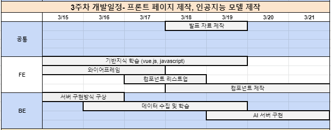
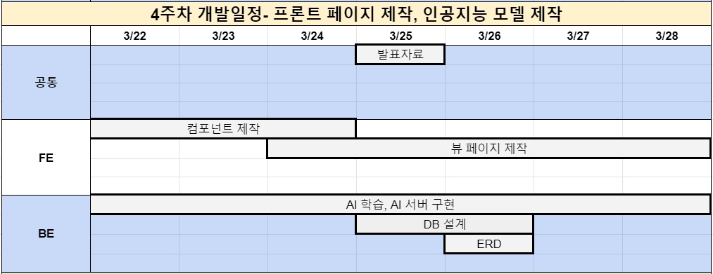
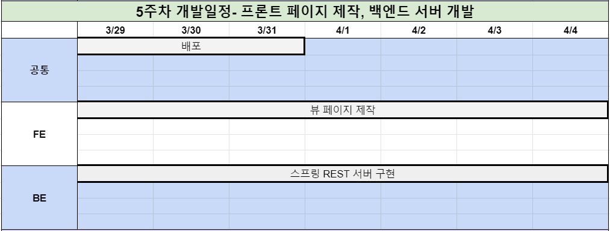
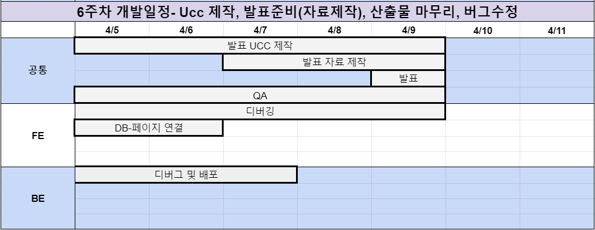

# SWITHME
#### Study With Me, AI가 사용자의 집중,비집중 여부를 파악하여 공부 집중 시간만을 측정해주고 학습패턴을 분석해주는 웹 플랫폼입니다.


---

## 1. 팀소개

- 팀명: 칼국수 레인저
- 참여자:
    - 팀장: 이하연
    - 팀원: 이기호, 임찬규, 박봉현, 이아름
- 역할 분담:
    - Front-end: 이하연, 이아름, 박봉현
    - Back-end: 이기호, 임찬규
    - QA: 박봉현, 임찬규
    - 테크리더: 이기호
    - 기획: 이아름
    

## 2. 주요 기능

1. 기존 타이머에 AI기술을 도입하여 자동 측정 타이머가 집중, 비집중 여부를 판단하여 집중 시간만을 측정해줍니다.
2. 학습 패턴 분석 기능으로 집중 시간, 집중 시간대, 방해요소 등을 세부적으로 진단해줍니다.
3. 그룹 기능으로 모임을 구성하여 함께 공부할 수 있습니다. 그룹 내 공동의 목표를 설정할 수 있으며 출석부와 랭킹기능이 있습니다.
4. 시험별 게시판에서 유저간의 커뮤니티를 형성할 수 있습니다.
5. 랭킹 기능으로 개인별 누적 집중 시간 순위를 확인할 수 있습니다.


## 3. 기획 의도

1. 언택트 사회가 되어감에 따라서 스터디 모임, 학교 수업까지도 비대면으로 진행되고 있습니다. 
2. 집에서 혼자 공부하는 것에 권태감과 어려움을 느끼는 사람이 많습니다. 그래서 요즘에는 캠스터디라는 것이 선풍적인 인기를 끌고 있습니다. 
3. 'AI 스터디메이트'는 서로를 감시하고, 자신을 보여줌으로써 조금 더 공부 자극을 얻고 집중할 수 있도록 하는 시스템입니다.
4. 저희는 이런 캠스터디라는 시스템과 스탑워치를 통해 자신의 공부 시간을 측정하는 서비스를 결합한 서비스를 기획하고자 했습니다.

## 4. 시장조사

- 기존 서비스는 사용자가 직접 타이머를 조작해야하는 불편함이 존재.   
- 사용자의 학습 태도를 자동적으로 판별하여 직접 조작 없이 시간을 재 편의성을 제공하고, 다양한 통계 자료 제공.

## 5. 개발 환경

|   분류   |                                        정보                                         |
| :------: | :---------------------------------------------------------------------------------: |
| 운영체제 |                                     Windows 10                                      |
| 개발 툴  | Spring Tools 4.9.0 - WINDOWS 64-BIT<br>IntelliJ IDEA Ultimate<br>Visual Studio Code |
|   JDK    |                                     JAVA 8이상                                      |

## 6. 주요 기술 스택/도구

| 분류     | 기술 스택/도구 | 버전     | 비고                    |      |
| -------- | -------------- | -------- | ----------------------- | ---- |
| 언어     | Python         | 3.7.6    | Anaconda 가상환경       |      |
| 머신러닝 | Numpy          | 1.18.1   |                         |      |
|          | Scipy          | 1.4.1    |                         |      |
|          | Scikit-learn   | 0.22.1   |                         |      |
| 딥러닝   | Tensorflow     | 2.0.0    | Deep Learning Framework |      |
|          | Keras          | 2.2.4-tf | High Level API          |      |
| 시각화   | Matplotlib     | 3.1.3    |                         |      |
|          | Tensorboard    | 2.1.0    | TensorFlow 시각화 툴킷  |      |
| 기타     | Anaconda       | 4.8.2    | 패키지 관리 및 가상환경 |      |
|          | tqdm           | 4.42.1   | 반복문 진척도 시각화    |      |


## 7. 시스템 구성도


## 8. Naming Rules

### Java, Vue, Javascript

[Naming Rules]

- Class는 Pascal 표기법
ex) MainController.java, UserDto.java
- Method, Variable은 Camel 표기법
ex) public void setUserName();
ex) private String userId();
- Method는 동사+명사 형태
ex) getUserId();
ex) selectAll();

[Statement Rules]

- if 문을 쓸 때 1줄인 경우 같은 라인에다가, 1줄 이상일 때는 예시처럼 사용

```java
if (true) statement1;

if (true) {
    statement1;
    statement2;
}
```

### Python

[Naming Rules]

- Variable, function 은 snake 표기법
- function은 동사+명사 형태


## 9. Commit convension

### GIT

- Develop 브랜치에서 작업
- Master는 건들지 않는다
- 기능마다 임시 branch인 feature생성해 작업

    ex) feature/front/user-hana, feature/back/user-chanchan

- 적어도 Story이슈 하나마다 커밋

[https://woowabros.github.io/experience/2017/10/30/baemin-mobile-git-branch-strategy.html](https://woowabros.github.io/experience/2017/10/30/baemin-mobile-git-branch-strategy.html)

```
Commit Message : 

[Jira 이슈 번호] 타이틀: 설명
예시 : [S04P12B207-15]Docs: 커밋 메세지 규칙 수정

Feat : 코드나 테스트를 추가했을 때 + 라이브러리 추가하는 경우
Fix : 버그를 수정했을 때
Remove : 코드를 제거했을 때
Update : 코드를 수정하는 경우
Docs : 문서를 수정했을 때
Style : 코드 포맷팅에 대한 부분 변경, CSS 등
Rename : 이름을 변경했을 때
Move : 코드를 이동할 때
Refac : 기능 변화 없이 코드 내부 구조 변경하는 경우
```


## 10. 개발일정





